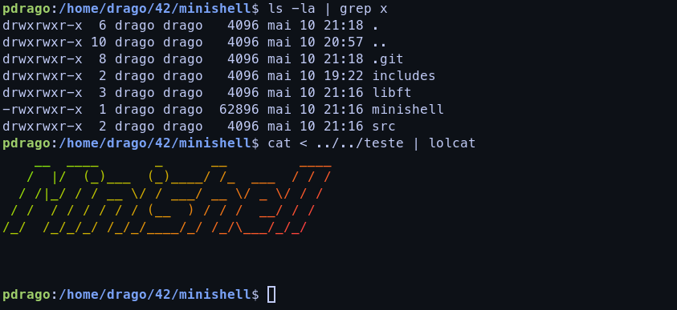

# Minishell

<p align="center">
    
</p>

<p align="center"> This project was about creating our own shell in C, inspired by Bash. </p>

---
<p align="center">
    
</p>

<h3 align="center">About our Journey</h3>
This project was undoubtedly the most challenging and largest endeavor we've undertaken within the 42 Common Core this far. We approached this task our own way: without any form of guides. Therefore, the resolution you observe in our code reflects the battles our minds waged against the innumerous problems encountered along our journey. In the end, the product is a quite good shell, although with not that good of code.

---
### Terminal VS Shell VS Prompt
Understanding the difference between these three different softwares is crucial:

- Terminal: The correct name would be a Terminal Emulator since a real terminal was a physical machine dedicated to accessing resources from a mainframe and acts as an interface for users to work with these resources. So, the terminal emulator is the software we use to emulate that behavior in modern computers. Basically, the terminal emulator is the graphical application that runs the shell. A few examples are Gnome Terminal, Alacritty, Terminator, etc.

- Shell: Shell is a command interpreter that allows the user to instruct the kernel to perform tasks such as listing files in the current working directory, creating a file, changing file permissions, and every other action that the kernel allows users to perform. A few examples of shells are Bash, Zsh, Fish, PowerShell, etc.

- Prompt: The prompt is the command that you provide to the shell for interpretation. `$ ls | grep` a is an example of a prompt in Bash.

### Processes
When a program is executed in Linux, it can be called a process, and processes come with several attributes, such as permissions, a PID (Process Identifier), a file descriptors table, and other data. So when you execute `$ ls` in your shell, what is really happening is that the kernel is executing a binary executable located in the `PATH` of your system as a process.

Processes can create other processes; this is called forking (`man fork`). The processes can be referred to as the Parent Process (for the process that is spawning another process) and the Child Process (for the process that has been spawned). A child process's execution starts at the same moment the `fork()` syscall was called.

```c
int main()
{
    int pid;

    pid = fork();
    if (pid == 0)
    {
        printf("Child Process: %i\n", getpid());
        exit(1);
    }
    else
    {
        printf("Parent Process: %i\n", getpid());
        exit(0);
    }
}
```

The above example demonstrates the branching that `fork()` causes, as there are two different blocks of code in the same program, but each process only executes one of them.

### ENV
Env can be described as either the collection of the environment variables that the system has or the shell command `man env`. Let's focus on the first concept:

Unix systems hold useful variables that every executed program can access through a parameter called `envp`, located in the main function (`int main(int argc, char *argv[], char *envp[])`). There are variables like the current user's username, the current user's home directory, etc. You can check the current list of environment variables with the `env` command, add new environment variables with the `export` command, and delete existing environment variables with the `unset` command.
### PATH
Before we understand the Path concept, we need to understand how programs and commands are executed on Linux. If you navigate to the directories `/bin` or `/usr/bin`, you'll see that there are tons of executables inside these directories, such as `ls`, `echo`, `pwd`, and other commands that you probably know. When you type `ls` in the shell, it will search in a few preselected directories for an executable binary called `ls`. In this case, `/bin/ls` or `/usr/bin/ls` would be searched, and when the shell finds it, it is executed.

The `$PATH` is the environment variable that holds the preselected directories that the system will look for executables for you. It is an environment variable just like the others where you can change its value or even delete it (give it a try, don't be afraid; when you relaunch your shell, the PATH variable will be created again).
### Pipe
A pipe in a shell occurs when you instruct one command to read the output from another command: `ls | grep x`. Here, the `ls` command outputs all the files in the current directory, then `grep x` reads that output and prints on the screen only the lines that contain the letter `x`.

Note: You can pipe as many commands as you want in a pipeline. Just keep in mind that not every command reads input; some of them only receive command line arguments, like `echo`.

In C, we can use the syscall `pipe()` to recreate that behavior, but it is not as simple as `pipe(command1, command2)`. The only thing this function does is receive an integer array of size 2 (`int arr[2]`) and then create two connected file descriptors: one for reading (which will be put at index `0` of the array) and one for writing (which will be put at index `1` of the array). That's it.

```c
int main()
{
    int pipe_fd[2];
    char buff[19];

    pipe(pipe_fd);
    write(pipe_fd[1], "Writing a Message\n", 19);
    read(pipe_fd[0], buff, 19);
    printf("%s\n", buff);
}
```
The above example is not useful code, but it can demonstrate what the `pipe()` function is really doing. We pipe our array, then we write a string to index `1`, and then we read from index `0`. The real use of this function can be achieved when we combine it with `dup2()`, which allows us to substitute a standard file descriptor of a process with a file descriptor from the pipe we created. This is not the only use, but it is the one you'll see most often in a project like a shell.

```c
int main()
{
    int pipe_fd[2];
    char buff[49];
    int pid;

    pipe(pipe_fd);
    pid = fork();
    if (pid == 0)
    {
        dup2(pipe_fd[1], 1);
        printf("Message being written to this process new STDOUT");
        exit(0);
    }
    else
    {
        waitpid(pid, NULL, 0);
        read(pipe_fd[0], buff, 49);
        printf("%s\n", buff);
    }

}
```

### Minishell Project
A few recommendations for the Minishell project:
1. Study how to properly assemble a Lexer, Parser, and Executor. (We did not do that, and the amount of time wasted can't be measured.)
2. Understand very well what happens with file descriptors when a process is forked (file descriptors created by a `pipe()` and the standard file descriptors). Experiment a lot with `dup()`, `dup2()`, and `pipe()`.
3. Understand very well how the bash features work before starting to implement them. You probably don't know important details about heredoc, redirections, pipes, built-ins, etc. Trying to implement those details in the middle of some old logic will be difficult. (We know because we did it.)
4. You don't need to make a perfect copy of bash. We've tried our best to do that, and again, the amount of time wasted can't be measured. Focus on the subject and think about how to defend your design choices (but try to at least never have a segfault).
5. Learn about valgrind supression file
